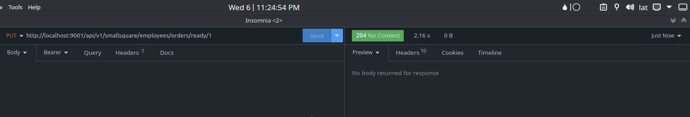
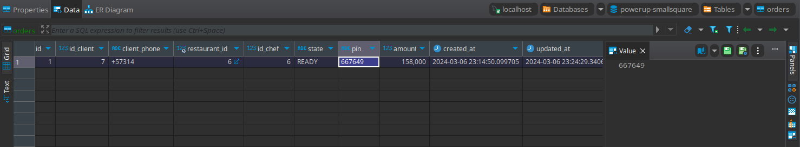
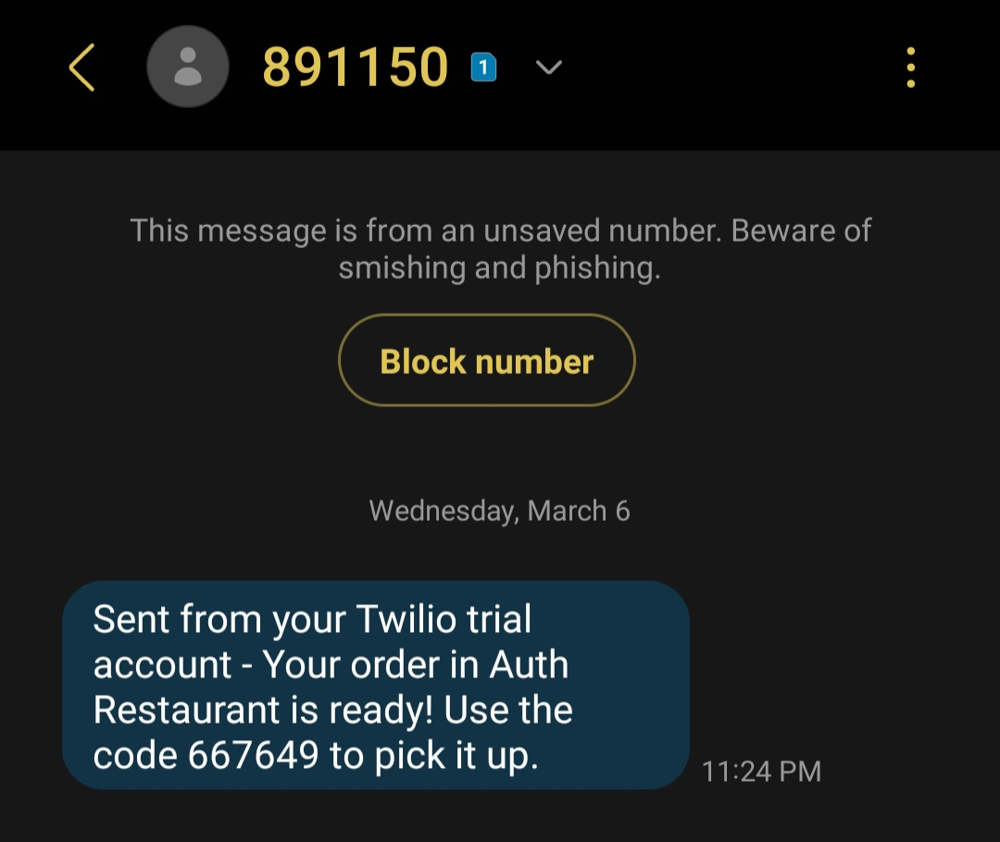

<br />
<div align="center">
<h3 align="center">PRAGMA POWER-UP</h3>
  <p align="center">
    In this challenge you are going to design the backend of a system that centralizes the services and orders of a restaurant chain that has different branches in the city.
  </p>
</div>

### Built With

* 
* 
* 
* 


<!-- GETTING STARTED -->
## Getting Started

To get a local copy up and running follow these steps.

### Prerequisites

* JDK 11 [https://jdk.java.net/java-se-ri/11](https://jdk.java.net/java-se-ri/11)
* Gradle [https://gradle.org/install/](https://gradle.org/install/)
* MySQL [https://dev.mysql.com/downloads/installer/](https://dev.mysql.com/downloads/installer/)

### Recommended Tools
* IntelliJ Community [https://www.jetbrains.com/idea/download/](https://www.jetbrains.com/idea/download/)
* Postman [https://www.postman.com/downloads/](https://www.postman.com/downloads/)
* Insomnia (Postman alternative) [https://insomnia.rest/download](https://insomnia.rest/download)

### Installation

1. Clone the repo
2. Change directory
   ```sh
   cd Powerup-MessengerMicroservice
   ```
#### This microservice does not require any datasource, so we can remove the following lines from the application.yml file
   ```yml
   # src/main/resources/application.yml   
   spring:
      datasource:
          url: jdbc:mysql://localhost/powerup
          username: root
          password: 1234
   ```

#### Before running the application we need to register in the [Twilio](https://www.twilio.com/) platform with the free trial

#### We need to get:
- Number capable of sending SMS (In my case I get one from U.S.)
- Account SID
- Auth Token

#### Also, We need to register our own phone number (In my case my 🇨🇴 number +57...) in Twilio to get the SMS

#### Now, we need to follow [this Twilio Tutorial](https://github.com/twilio/twilio-java) for Java

#### Aditional Settings:
- In my case I set the **Twilio number as Restaurant's number** and my **phone number as the Client's number**

## Evidence HU_14 working fine:

- ### Successfully Response from SmallSquareMicroservice when setting order as READY 
   Wednesday, March 6 | 11:24 pm
  
- ### Order registry in the database updated
    - **Order PIN:** 667649
    - **Order 'updated_at':** Wednesday, March 6 | 23:24 (11:24 pm)
    
- ### Message received in my phone
    Wednesday, March 6 | 11:24 pm **with code:** 667649 
    

<!-- USAGE -->
## Usage

1. Right-click the class PowerUpApplication and choose Run
2. Open [http://localhost:9002/swagger-ui/index.html](http://localhost:8081/swagger-ui/index.html) in your web browser

<!-- ROADMAP -->
## Tests

- Right-click the test folder and choose Run tests with coverage


